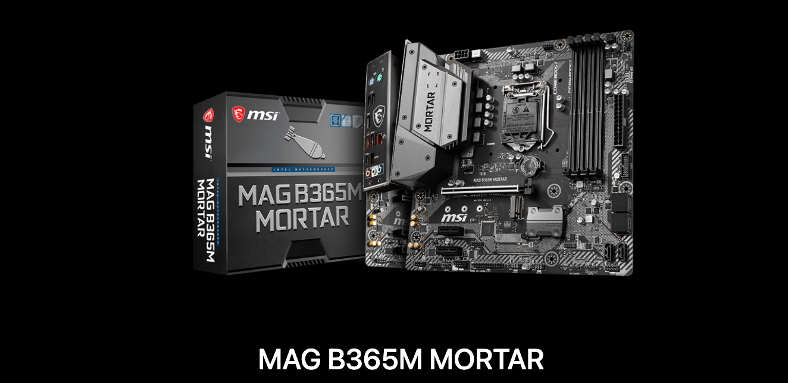
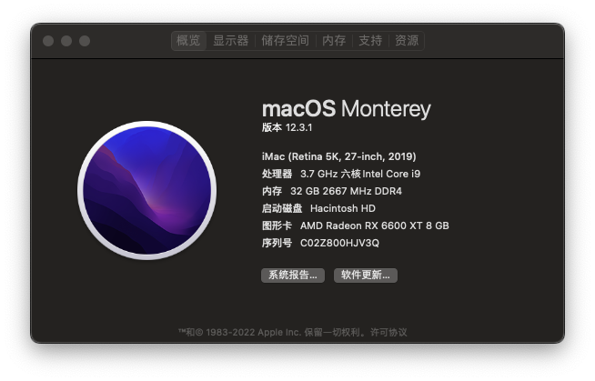
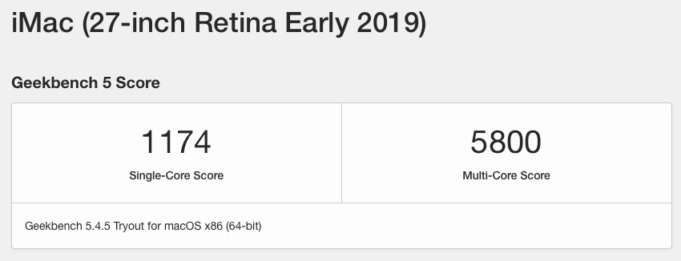
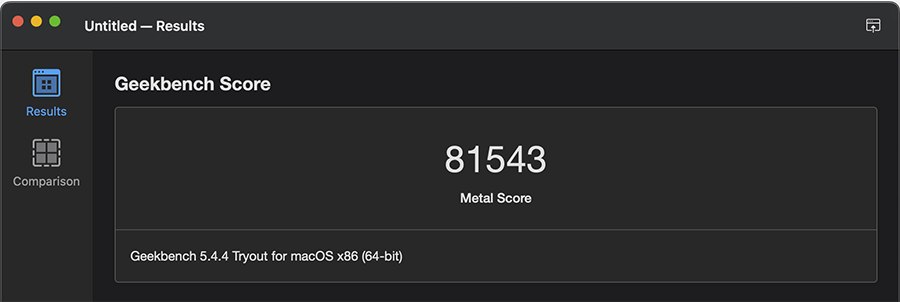

# MSI-MAG-B365M-MORTAR Hackintosh OpenCore EFI

### [简体中文](README.zh_CN.md)

### OpenCore

[OpenCore 0.9.1](https://github.com/acidanthera/OpenCorePkg)

### OS Version Tested

- macOS Monterey 12.x
- macOS Ventura  13.x 

### Hardware

- Motherboard:MSI-MAG-B365M-MORTAR
- Bios Version: E7C67UIMS.143（2021-01-17）
- CPU: Intel i5-9600K
- RAM: AVEXIR 2x16GB DDR4 2666MHz
- SSD: UNSPC512AKMM 512G MacOS
- SSD: Samsung SSD 840 Series 120G Windows
- SSD: Crucial MX500 1TB
- iGPU: Intel UHD630
- GPU: XFX SPEEDSTER MERC308 Radeon RX6600XT 8GB
- Audio: Realtek ALC256
- Ethernet: Intel L219V
- Wireless: BCM943602CS With PCIE Adapter
- Display:PHL272B
- PSU: SEASONIC 650W 80Plus Gold
- CASE:Jonsbo U4 Plus

### Bios Setup

| Name | Option |
| ----- | --- |

### Notes

 - Use [OpenCore Configurator](https://mackie100projects.altervista.org/opencore-configurator/) build your SMBIOS
 
### ScreenShot 

- About This Mac

- Geekbench5 Score i5-9600K 

- Geekbench5 Score Metal XFX SPEEDSTER MERC308 Radeon RX 6600 XT 8GB

