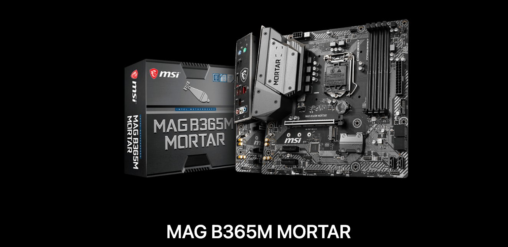
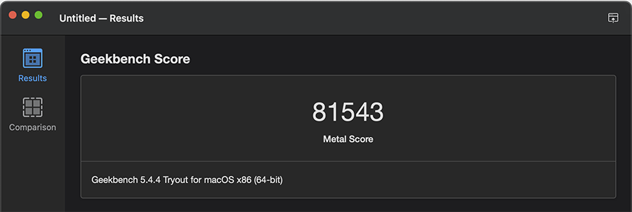

# MSI-MAG-B365M-MORTAR  黑苹果 OpenCore EFI

### [English](https://github.com/hackintosh-efi/MAG-B365M-MORTAR-OpenCore)

### OpenCore

[OpenCore 0.9.9](https://github.com/acidanthera/OpenCorePkg)

### 可安装系统

- macOS Monterey 12.x 
- macOS Ventura    13.x 
- macOS Sonoma   14.x 

### 硬件

- 主板: MSI-MAG-B365M-MORTAR
- Bios版本: E7C67UIMS.143（2021-01-17）
- 处理器: 英特尔 i5-9600K
- 内存: 宇帷 2x16GB DDR4 2666MHz
- 硬盘: 1.UNSPC512AKMM 512G MacOS
- 硬盘: 2.三星 SSD 840 Series 120G Windows
- 硬盘: 3.英睿达 MX500 1TB
- 独显: XFX RX6600XT 8GB 海外版 V2
- 声卡: 瑞昱 ALC256
- 网卡: 英特尔 L219V
- 无线: BCM943602CS 加PCIE转接卡
- 显示器: PHL272B
- 电源: 海韵 650W 80Plus 金牌全模组
- 机箱: 乔思伯 U4 Plus

### Bios 设置

| 名称 | 选项 |
| ----- | --- |

### 注意事项

 - 使用 [OCAuxiliaryTools](https://github.com/ic005k/OCAuxiliaryTools/releases) 生成 SMBIOS

### 参考内容

[1.黑苹果安装过程演示](https://hackintosh.club/d/10000060)

[2.英特尔无线网卡WiFi驱动](https://hackintosh.club/d/10000015)

[3.英特尔无线网卡蓝牙驱动](https://hackintosh.club/d/10000017)

[4.我的B站黑苹果教程](https://space.bilibili.com/244390800/video)

[6.黑果之家](https://hackintosh.club/)

### 系统截图

- 关于本机

- Geekbench5 跑分 i5-9600K 

- Geekbench5 跑分 XFX RX6600XT 8GB 海外版 V2

### 联系我们 

- QQ群: 23304408

